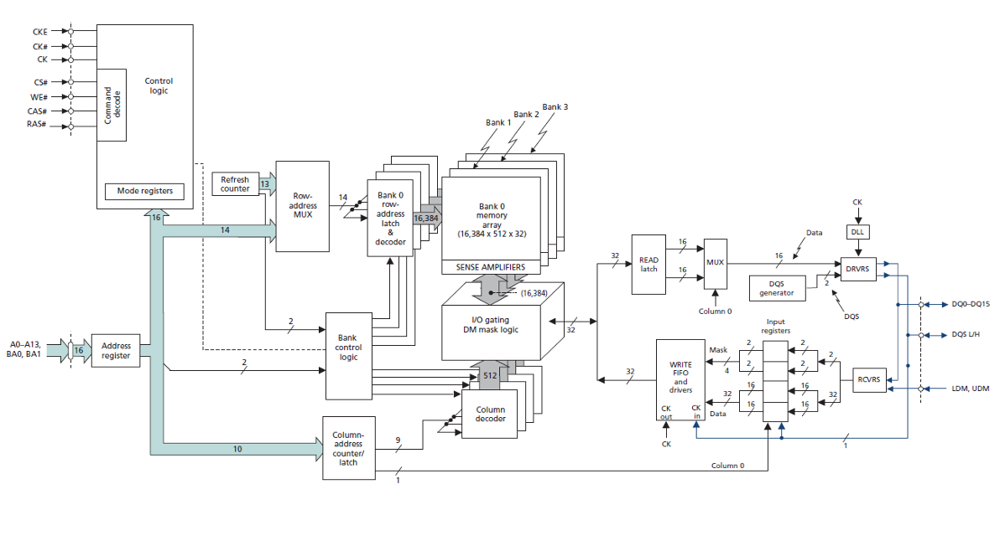
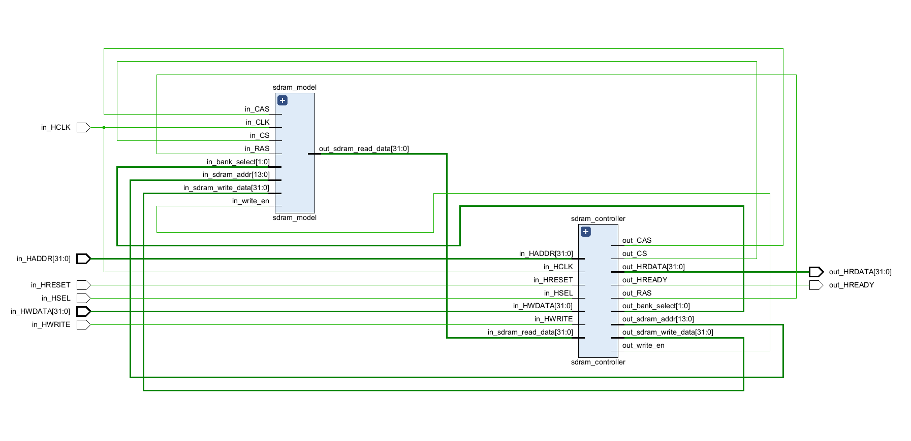
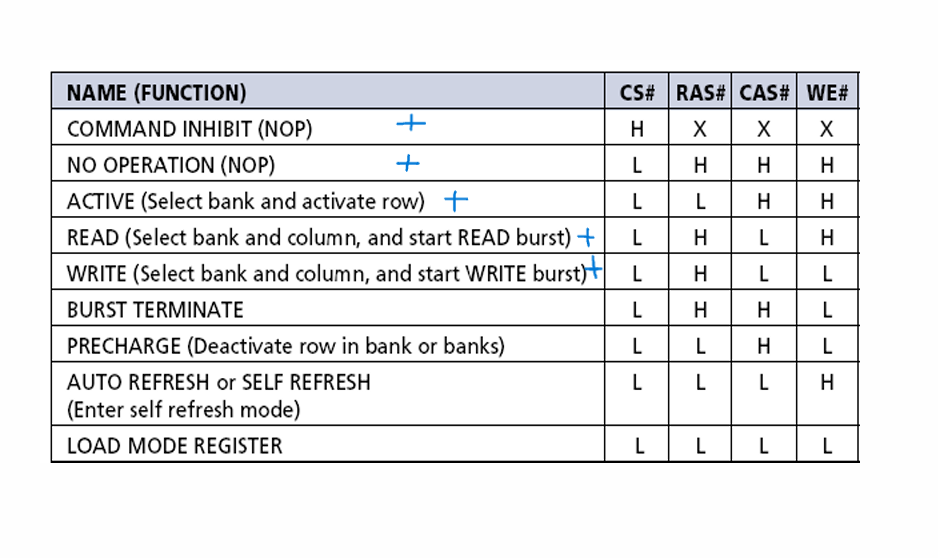
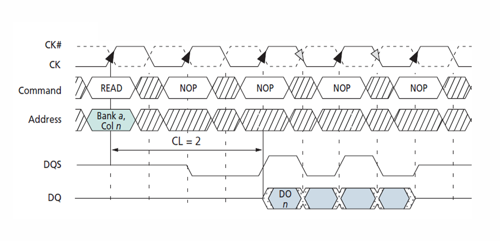
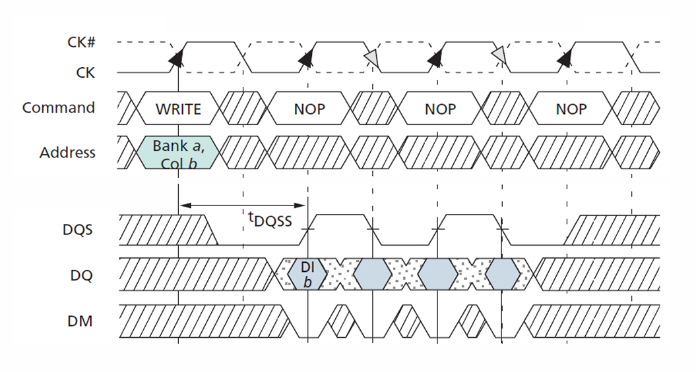
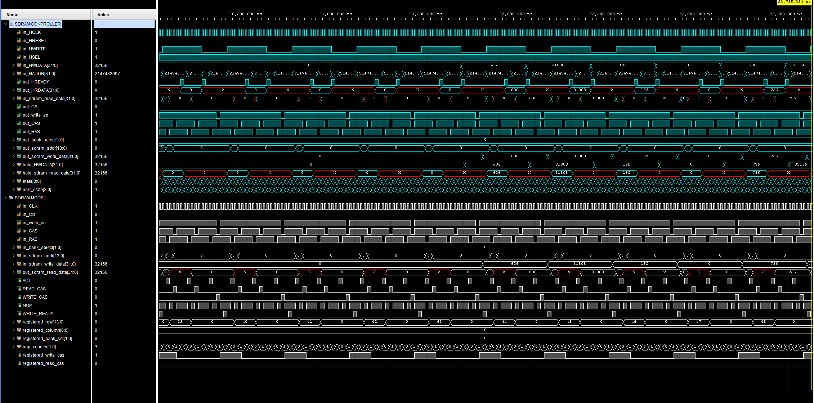
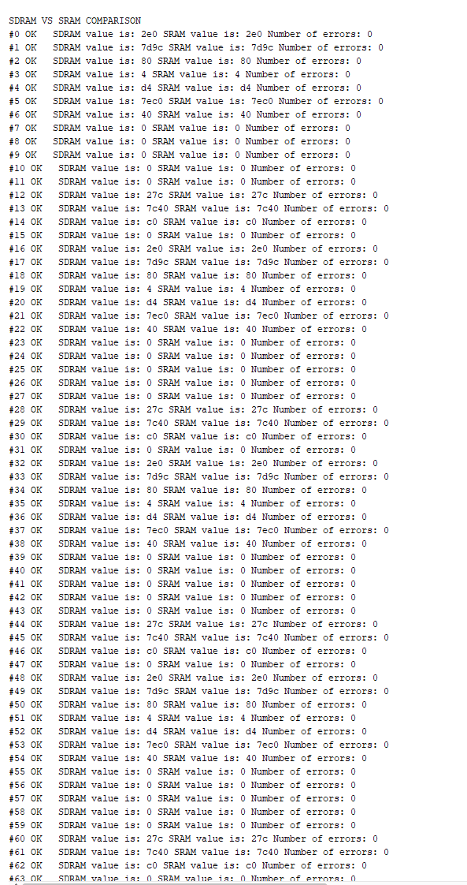

# SDRAM Controller and Model

This project involves the integration and implementation of an SDRAM (Synchronous Dynamic Random-Access Memory) controller in Verilog. The SDRAM controller is designed to manage read and write operations to SDRAM memory using a finite state machine (FSM) to handle timing and command sequences. This README file provides an overview of the SDRAM controller, SDRAM model, and testbench for verification.



## Table of Contents

1. [Overview](#overview)
2. [SDRAM Controller](#sdram-controller)
3. [SDRAM Model](#sdram-model)
4. [Verification](#verification)
5. [Directory Structure](#directory-structure)
6. [To Do](#to-do)

---

## Overview

The SDRAM controller manages the timing and control signals required to interface with SDRAM memory. Supported commands are shown in blue. It supports the following operations:

- **COMMAND INHIBIT (NOP):** Invalid command.
- **NOP (No Operation):** Idle state for timing management.
- **ACT (Activate):** Activates a row in the SDRAM.
- **READ:** Reads data from the activated row.
- **WRITE:** Writes data to the activated row.
- **BURST TERMINATE:** Ends the current burst operation. (Unsupported)
- **PRECHARGE:** Deactivates the open row in a bank. (Unsupported)
- **AUTO REFRESH:** Refreshes SDRAM contents to prevent data loss. (Unsupported)
- **LOAD MODE REGISTER:** Loads settings into the SDRAM mode register. (Unsupported)



---

## SDRAM Controller

The SDRAM controller (`sdram_controller.v`) handles read and write operations using a finite state machine (FSM). The controller generates the necessary control signals (`out_CS`, `out_write_en`, `out_CAS`, `out_RAS`) and manages the address and data buses.

### Key Signals

- **Clock (`in_HCLK`):** System clock.
- **Reset (`in_HRESET`):** System reset.
- **Write Enable (`in_HWRITE`):** Indicates a write operation.
- **Slave Select (`in_HSEL`):** Selects the SDRAM controller as the active slave.
- **Address (`in_HADDR`):** Address bus.
- **Write Data (`in_HWDATA`):** Data bus for write operations.
- **Read Data (`out_HRDATA`):** Data bus for read operations.

### FSM States

- **IDLE:** Waits for a read or write request.
- **READ_ACT:** Activates a row for reading.
- **READ_CAS:** Sends column address for read.
- **WRITE_ACT:** Activates a row for writing.
- **WRITE_CAS:** Sends column address for write.
- **NOP:** Idle state for timing management.

### Command Sequences

1. **ACT (Activate):** Activates a row in the SDRAM by providing the row address and bank select signals (`out_sdram_addr`, `out_bank_select`). Prepares the SDRAM for read or write operations.
2. **READ:** Reads data from the activated row. Involves sending column address and bank select signals (`out_sdram_addr`, `out_bank_select`) after the ACT command.
3. **WRITE:** Writes data to the activated row. Involves sending column address and bank select signals (`out_sdram_addr`, `out_bank_select`) after the ACT command, followed by providing data (`out_sdram_write_data`) to be written.
4. **NOP (No Operation):** Idle states between commands where no action is taken. Allows for proper timing and sequencing of SDRAM operations. The NOP between ACT and CAS is necessary due to the RAS-CAS latency being 2 cycles, meaning there's a delay of 2 clock cycles between activating a row (ACT) and accessing the column (CAS). This ensures that the SDRAM controller operates within the timing constraints of the SDRAM protocol.




---

## SDRAM Model

The SDRAM model (`sdram_model.v`) simulates the behavior of an actual SDRAM chip. It handles the read and write operations based on the control signals from the SDRAM controller.

### Key Features

- **Chip Select (`in_CS`):** Selects the SDRAM chip.
- **Write Enable (`in_write_en`):** Enables write operations.
- **Column Address Strobe (`in_CAS`):** Activates column address.
- **Row Address Strobe (`in_RAS`):** Activates row address.
- **Bank Select (`in_bank_select`):** Selects the memory bank.
- **SDRAM Address (`in_sdram_addr`):** Address bus for SDRAM.
- **SDRAM Write Data (`in_sdram_write_data`):** Data bus for write operations.
- **SDRAM Read Data (`out_sdram_read_data`):** Data bus for read operations.

### Algorithm

1. **Parameter Definitions:** Data width (`DATA`), row count (`ROW`), and column count (`COLUMN`).
2. **Internal Signals:** Signals such as `ACT`, `READ_CAS`, `WRITE_CAS`, `NOP`, and `WRITE_READY` are defined based on the input signals to manage SDRAM operations.
3. **Registers:** Registers hold row, column, bank select, and NOP counter values during operations.
4. **Clocking Block:** Updates the registers based on input signals and manages the NOP counter.
5. **Combinational Block:** Handles SDRAM read and write operations based on the state of `WRITE_READY` and `in_write_en` signals. Uses a case statement to select the appropriate bank for read or write operations.

---

## Verification

---

### Behavioral Simulation Result



---

### Self-Checking Testbench Verification



---

## Directory Structure

The project is organized as follows:

```text
/docs       Project documentation
/src        Source files for SDRAM controller and model
/testbench  Testbench files for verification
```

---

## To Do

- **Write testbench:** Create a comprehensive testbench file for the design.
- **Validate FSM with assertions:** Use verification methods like assertions to ensure FSM correctness.
